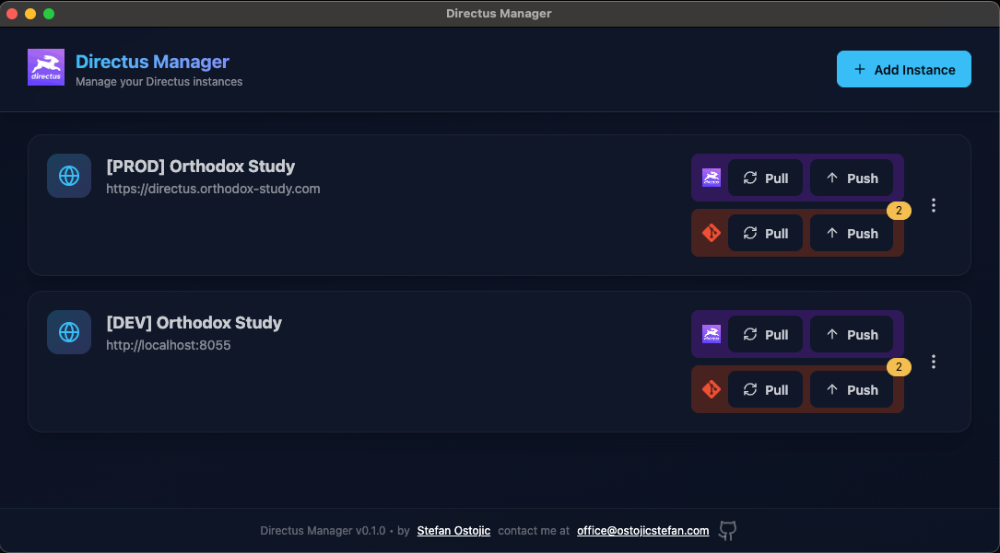
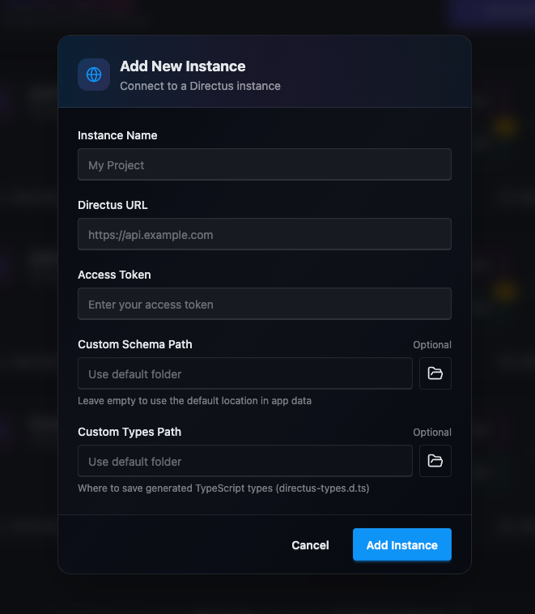
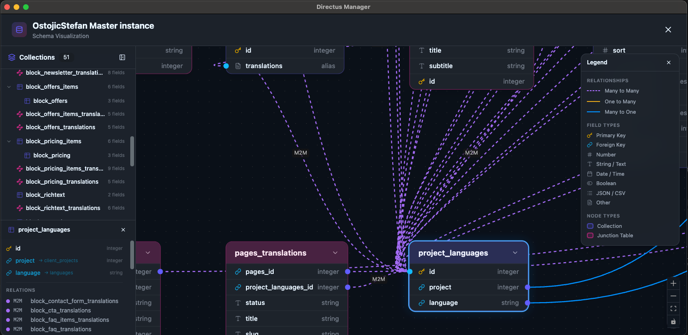

# Directus Manager 🚀

Directus Manager is a powerful desktop client built with **Electron + Vue** designed to streamline your workflow when managing Directus instances. It provides a native feel and enhanced performance for developers who want a dedicated environment for their headless CMS management.


---

## ✨ Features

* **Native Performance:** Fast, lightweight desktop experience via Electron.
* **Modern UI:** Built with Vue and styled for clarity and ease of use.
* **Instance Management:** Quickly switch between different Directus environments.
* **Interactive Schema Viewer:** Visualize your database schema with an interactive graph showing collections and their relationships.
* **TypeScript Type Generation:** Pull TypeScript types directly from your Directus instance.
* **Git Integration:** Version control your schemas with built-in Git support.
* **Developer Friendly:** Open for modifications and community improvements.

---

### Adding a New Instance

Connect to any Directus instance by providing its URL and access token. You can optionally set custom paths for schema storage and TypeScript type generation.



| Field | Description |
|---|---|
| **Instance Name** | A friendly name to identify your instance |
| **Directus URL** | The base URL of your Directus API (e.g. `https://api.example.com`) |
| **Access Token** | Your Directus static access token (stored encrypted) |
| **Custom Schema Path** | Optional custom folder for storing pulled schemas (defaults to app data) |
| **Custom Types Path** | Optional path to save generated TypeScript types (`directus-types.d.ts`) |

---

### Interactive Schema Viewer

Explore your database structure with a visual, interactive schema graph. Collections are listed in a sidebar and rendered as nodes on a canvas, with edges representing relationships between tables.



- Browse all collections in the sidebar and click to focus on a specific table
- View fields, types, and relationships at a glance
- Zoom, pan, and rearrange nodes to explore complex schemas
- Color-coded edges distinguish different relationship types

## 🛠️ Tech Stack

* **Framework:** [Vue.js](https://vuejs.org/)
* **Desktop Wrapper:** [Electron](https://www.electronjs.org/)
* **Styling:** Tailwind CSS / DaisyUI (base-content/40)

## 🚀 Getting Started

### Installation via npm (Recommended)

Install globally to use the `directusmanager` command from anywhere:

```bash
npm install -g directusmanager
```

Then run:

```bash
directusmanager
```

### Updating to a New Version

```bash
npm update -g directusmanager
```

### Installation from Source

#### Prerequisites
* Node.js (Latest LTS recommended)
* npm or yarn

1. Clone the repository:
   ```bash
   git clone https://github.com/OSZII/DirectusManager.git
   cd DirectusManager
   ```

2. Install dependencies:
   ```bash
   npm install
   ```

3. Start the development server:
   ```bash
   npm run dev
   ```

4. Build for production:
   ```bash
   npm run build
   ```

## 📄 License

This project is licensed under a custom license — see [LICENSE.md](LICENSE.md) for details. Attribution must remain visible in the application footer.